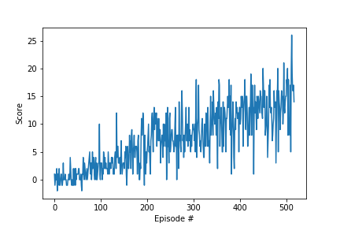

# Project: Navigation

## Learning Algorithm

To train the agent, we implemented the Deep Q Learning algorithm with PyTorch. The goal of DQN is to learn an approximation of the optimal action-value function Q using a deep neural network.

In our implementation, the network contains 2 hidden layers, with 64 neurons in each one. It takes as input a vector of observations from the environment and outputs the value of each action available to the agent.

We used the following hyper-parameters:

- Replay buffer size = 1e5
- Batch size = 64
- Discount factor = 0.99
- Learning rate for target parameters = 1e-3
- Learning rate for network optimizer = 5e-4

## Plot of Rewards

After 500 episodes, the agent managed to get an average reward greater than 13 over 100 consecutive episodes, and successfully solved the environment.

## Ideas for Future Work

We could try to improve the agent's performance by tuning the hyper-parameters to find their optimal values.

We could also implement the [Rainbow](https://arxiv.org/abs/1710.02298) algorithm which combines several improvements to the original DQN algorithm:

- Double DQN
- Prioritized Experience Replay
- Dueling DQN
- Multi-step bootstrap targets
- Distributional DQN
- Noisy DQN